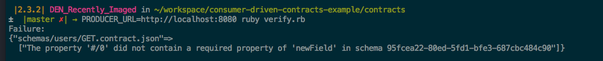

# Consumer-Driven Contract Testing

Consumer-Driven contracts provide a mechanism for API consumers to define the interface they expect an API producer to implement. This is in contrast to a typical producer/consumer scenario in which the producer defines the API and the consumer is responsible for learning the API and adapting to changes.

For a short intro (in story form) to contract testing, take a look at [this file](a-tale-of-two-repos-----and-a-third.md).


## The code

In this repository, we've included a producer application, a consumer application, and a contracts directory. In practice, all of these would be separate repositories.

In the contract "repo", we've included two scripts: [fakeout.rb](contracts/fakeout.rb) and [verify.rb](contracts/verify.rb). The former will run a lightweight server that returns responses that fulfill the contract. The latter executes tests within the producer repository that verify the actual API implements the contract.

### Requirements

* Ruby >= 2.3
* Java 1.8

### Setup

```
cd contracts && bundle install
cd ../producer && ./gradlew build
cd ../consumer && ./gradlew build
```

### Verification

```
cd producer && ./gradlew clean bootrun
```

Open a new terminal and:

```
PRODUCER_URL=http://localhost:8080 ruby verify.rb
```

If everything is setup correctly, you'll see: "SUCCESS!".

You can experiment with the verifications by modifying the [GET /users schema](contracts/schemas/users/GET.contract.json). For instance, if you add a new field to the properties section and the required section of the contract and re-run the verification script, you should see a failure like below.



### Acceptance testing the consumer

```
cd contracts && ruby fakeout.rb
```

Open a new terminal and:

```
cd consumer && ./gradlew clean test
```


## References and Inspiration

* https://github.com/thoughtworks/pacto
* http://martinfowler.com/articles/consumerDrivenContracts.html
* https://docs.pact.io/
